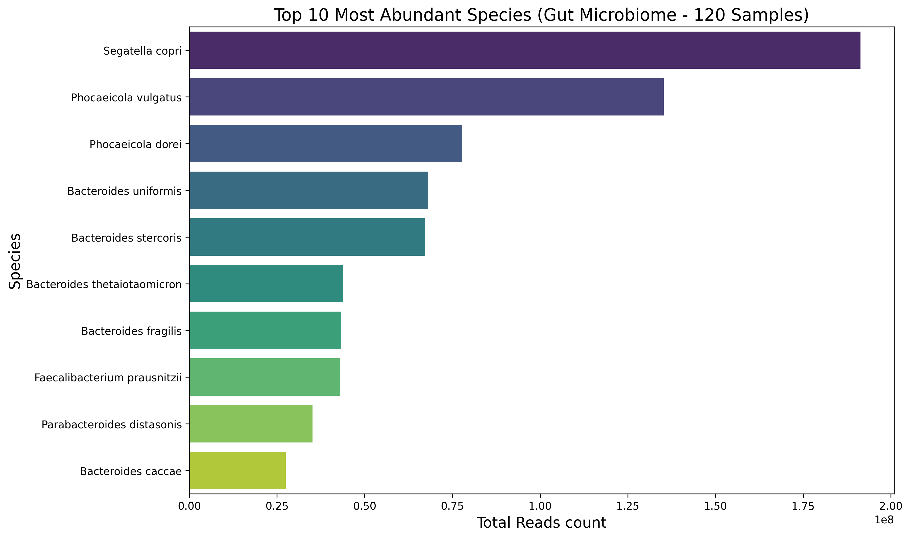
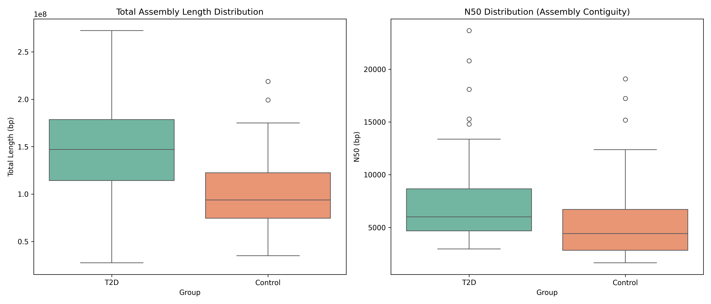
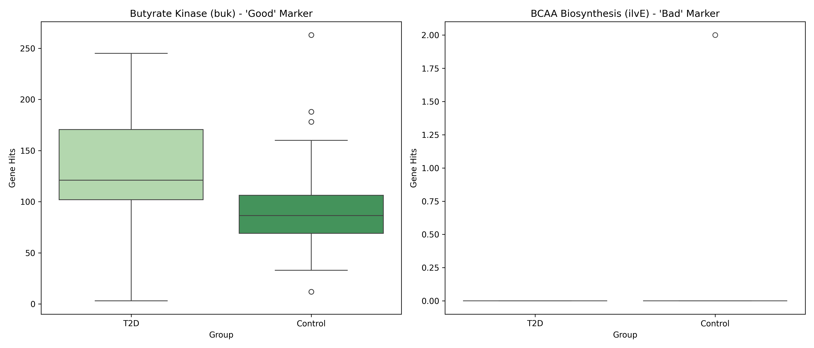

# 🧬 Metagenomic Analysis: Type 2 Diabetes vs. Healthy Controls

## 📖 Project Overview
This project investigates the gut microbiome differences between **Type 2 Diabetes (T2D)** patients and **Healthy Controls**. Using 120 metagenomic samples, we built a bioinformatics pipeline to answer two fundamental questions:
1.  **Taxonomy:** Who is there? (Bacterial composition)
2.  **Function:** What are they doing? (Metabolic potential)

Our goal was to go beyond simple bacterial lists and explore **microbial load (biomass)** and **functional gene abundance** related to gut health.

---

## 🧪 Study Design
* **Dataset:** 120 Samples (PRJNA422434)
    * 🔴 **T2D Group:** 60 Samples
    * 🟢 **Control Group:** 60 Samples
* **Method:** Shotgun Metagenomic Sequencing.
* **Pipeline Manager:** Snakemake

---

## ⚙️ The Pipeline (Methodology)
We used a "Targeted Mining" approach, focusing on specific metabolic markers rather than computationally expensive whole-genome annotation.

1.  **Quality Control:** `fastp` (Cleaning raw reads).
2.  **Profiling:** `Kraken2` (Identifying bacterial species).
3.  **Assembly:** `MEGAHIT` (Reconstructing genomes).
4.  **Gene Mining:** `BLAST` (Searching for *Butyrate Kinase* and *BCAA* genes).

---

## 📊 Key Results & Visualizations

### 1. The Taxonomic Landscape
We identified the most dominant bacteria across the cohort. The results show a microbiome heavily dominated by **_Segatella copri_** (formerly *Prevotella copri*) and *Bacteroides* species. This specific composition is often linked to "Enterotype 2" and has been associated with insulin resistance in recent literature.

*Figure 1: Top 10 most abundant species across 120 samples. Note the clear dominance of Segatella copri.*

---

### 2. The "Biomass" Discovery (Assembly Analysis)
A striking finding emerged when comparing the assembled genomes. **T2D samples yielded significantly larger assemblies** compared to healthy controls.
* **T2D Mean Length:** ~149 Mb
* **Control Mean Length:** ~101 Mb

This suggests a state of bacterial **overgrowth** (higher total microbial load) in the disease group.

*Figure 2: Boxplot comparing Total Assembly Length. T2D samples (right) show a significantly higher total length compared to Controls (left).*

---

### 3. Functional Gene Mining (The "buk" Gene)
We targeted the **Butyrate Kinase (`buk`)** gene, a marker for beneficial butyrate production.
* **Result:** The gene was found in 100% of samples.
* **Significance:** T2D patients showed a significantly **higher absolute count** of this gene ($p < 0.0001$).
* **Interpretation:** This mirrors the assembly results. T2D patients have *more bacteria overall*, so they have *more copies* of this gene. It indicates an expansion of the total community rather than a specific enrichment of beneficial bacteria relative to the rest.

*Figure 3: Abundance of metabolic marker genes. The 'buk' gene (left) is significantly higher in T2D, correlating with the increased biomass.*

---

## 💡 Conclusion
This study highlights that **Type 2 Diabetes** in this cohort is characterized by:
1.  A specific taxonomic signature dominated by *Segatella copri*.
2.  A significant increase in **total microbial biomass** (bacterial overgrowth).
3.  An increase in functional gene counts driven by this biomass expansion.

These findings suggest that considering **total microbial load** is crucial when interpreting metagenomic data in metabolic diseases.

---

## 🛠️ Tech Stack
* **Languages:** Python, Bash
* **Workflow:** Snakemake
* **Bioinformatics Tools:** fastp, Kraken2, MEGAHIT, BLAST+
* **Analysis:** Pandas, Seaborn, Biopython
